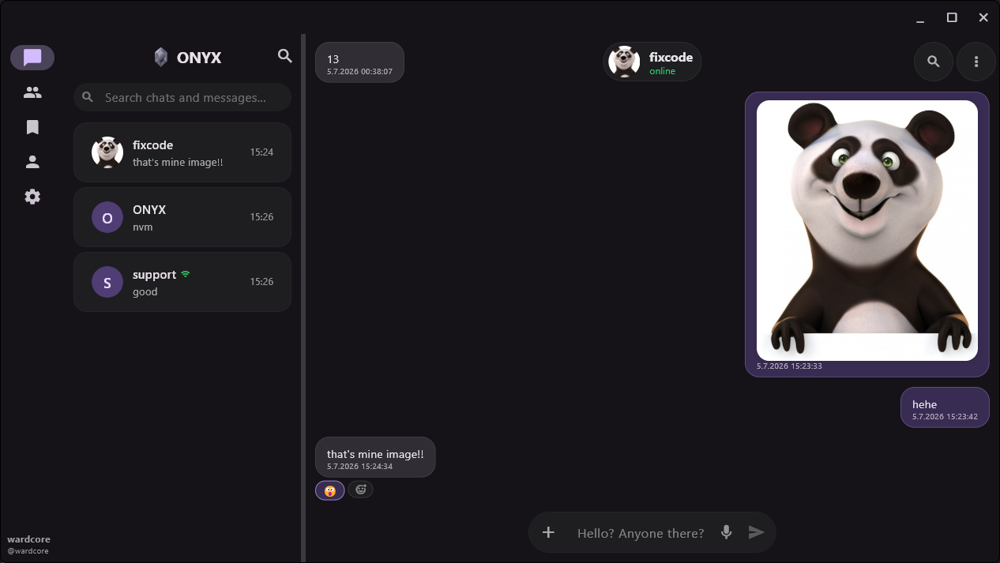

# ONYX Messenger

Encrypted, anonymous, self-hosted messenger with offline mesh and cross-device sync.



## Features

- End-to-end encrypted messaging — Ed25519 identities, no phone number or email
- Self-hosted — you can run and control the server of your group or channel
- Mesh mode — message contacts directly over Wi-Fi or Bluetooth; uses Wi-Fi when the contact is reachable on the local network, falls back to Bluetooth when it isn't, or pick the transport yourself
- WardLink — passively sync your Favorites across your own devices, and share data with other users over the local network via QR code
- Proxy support
- Group chats, favorites and direct messages
- Platforms: Windows, Linux, macOS, Android
- Anonymous accounts — no phone number or email required

## Development

ONYX is developed by a single developer with heavy use of AI-assisted coding tools.
All architecture decisions, security implementation and code review are done by the author.


## Building

Requires [Flutter](https://flutter.dev/) SDK.

```bash
flutter pub get
flutter run
```

## Server

The server component is available at: https://github.com/wardcore-dev/onyx-server

## Support ONYX
### BTC
bc1qpw2amf3j7w4swunx8mdfvk703uq3uadg9748tm
### LTC
ltc1qx37f0k2mckxp2je3cplkfvg7473nq8udpk4kg9
### XMR 
88R9RYWEL38Aj7As8KnT9bia7HyQkPf7AC9XK8HuDofaevudWAkLw9sjMhkQ4aNvzVdjdgdWSpvTw8RyHePcuHov6cwBTT2


*Your support helps maintain servers, infrastructure and development.*

## License

Copyright (C) 2026 WARDCORE

This program is free software: you can redistribute it and/or modify
it under the terms of the GNU General Public License as published by
the Free Software Foundation, either version 3 of the License, or
(at your option) any later version.

See [LICENSE.txt](LICENSE.txt) for full terms.
